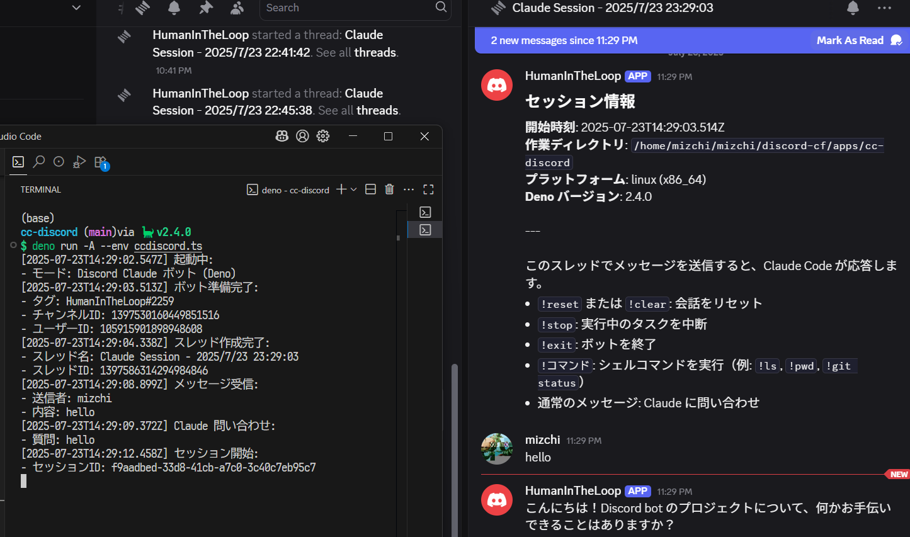
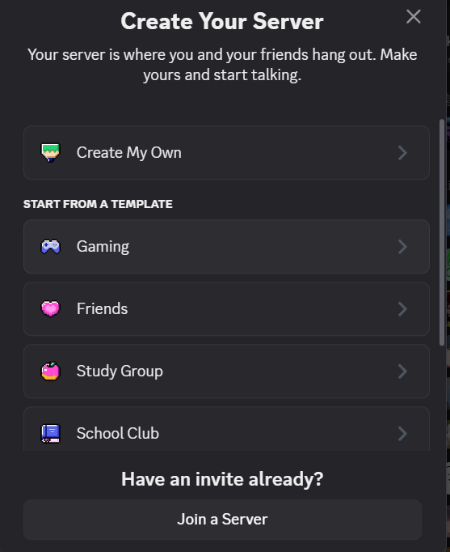
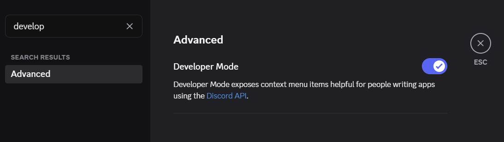
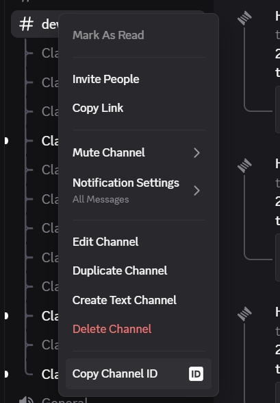
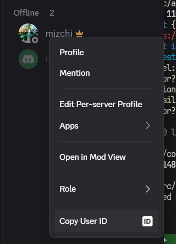

# ccdisord

Discord チャンネルに Claude Code を統合し、AI による支援と自動化を実現する Discord ボットです。



## 前提条件

- [Deno](https://deno.land/)
- Discord ボットトークン
- Claude Code CLI がインストールされ認証済みであること
  - 一度 `claude --dangerouslySkipPermissions` を実行

## 使い方（クイックバージョン）

```bash
export CC_DISCORD_TOKEN=your-discord-bot-token
export CC_DISCORD_CHANNEL_ID=your-channel-id
export CC_DISCORD_USER_ID=your-user-id
deno run -A jsr:@mizchi/ccdiscord
```

## セットアップガイド

チェックリスト

- [ ] Deno をインストール
- [ ] CC_DISCORD_TOKEN: Discord トークン
- [ ] CC_DISCORD_CHANNEL_ID: チャンネル ID を取得
- [ ] CC_DISCORD_USER_ID: あなたの Discord ユーザー ID
- [ ] `claude --dangerouslySkipPermissions` を認証

### 0. プライベート Discord サーバーの作成（オプションですが強く推奨）

⚠️ **重要**: まず、ボット専用のプライベート Discord サーバーを作成してください：

1. Discord を開き、サーバーリストの「+」ボタンをクリック



### 1. Discord ボットの作成

1. [Discord Developer Portal](https://discord.com/developers/applications) にアクセス
2. 「New Application」をクリックして名前を付ける
3. 左サイドバーの「Bot」セクションに移動
4. 「Add Bot」をクリック
5. 「Token」の下にある「Copy」をクリックしてボットトークンを取得
6. 「Privileged Gateway Intents」セクションで有効化:
   - Message Content Intent
7. 左サイドバーの「OAuth2」→「General」に移動
8. 「CLIENT ID」をコピー

### 2. ボットをサーバーに招待

1. 左サイドバーの「OAuth2」→「URL Generator」に移動
2. 以下のスコープを選択:
   - `bot`
3. 以下のボット権限を選択:
   - `Send Messages`（メッセージの送信）
   - `Create Public Threads`（公開スレッドの作成）
   - `Send Messages in Threads`（スレッドでメッセージを送信）
   - `Read Message History`（メッセージ履歴の読み取り）
4. 生成された URL をコピーしてブラウザで開く
5. あなたのプライベートサーバーを選択し「認証」をクリック

### 3. `CC_DISCORD_CHANNEL_ID` と `CC_DISCORD_USER_ID` の取得

Discord 設定で開発者モードを有効化







### 4. Claude Code の認証

- 一度 `claude --dangerouslySkipPermissions` を実行して権限を許可

### 5. 環境変数を設定して実行

```bash
export CC_DISCORD_TOKEN=your_bot_token_here
export CC_DISCORD_USER_ID=your_user_id_here
export CC_DISCORD_CHANNEL_ID=your_channel_id_here  # プライベートサーバーから
deno run -A jsr:@mizchi/ccdiscord
```

---

## Discord コマンド

ボットが実行されたら、Discord スレッドで以下のコマンドを使用できます:

- `!reset` または `!clear` - 会話をリセット
- `!stop` - 実行中のタスクを停止
- `!exit` - ボットを終了
- `!<command>` - シェルコマンドを実行
- 通常のメッセージ - Claude に支援を求める

## セキュリティ注意事項

このボットは強力な権限を持ち、コマンドを実行します。信頼できる環境でのみ、注意して使用してください。

## ライセンス

MIT ライセンス