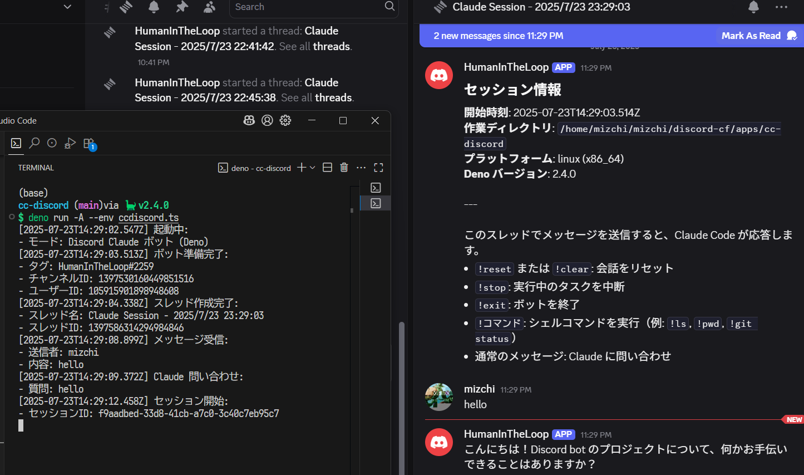
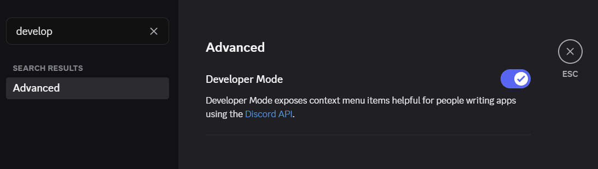

# ccdisord

A Discord bot that integrates Claude Code into Discord channels, enabling AI-powered assistance and automation.



## Prerequisites

- [Deno](https://deno.land/)
- Discord Bot Token
- Claude Code CLI installed and authenticated
  - run `claude --dangerouslySkipPermissions` once

## How to use (Quick Version)

```bash
export CC_DISCORD_TOKEN=your-discord-bot-token
export CC_DISCORD_CHANNEL_ID=your-channel-id
export CC_DISCORD_USER_ID=your-user-id
deno run -A jsr:@mizchi/ccdiscord
```

## Setup Guide

Checklist

- [ ] Install Deno
- [ ] `CC_DISCORD_TOKEN`: discord token
- [ ] `CC_DISCORD_CHANNEL_ID`: get your own
- [ ] `CC_DISCORD_USER_ID`: your discord user id
- [ ] Run `claude --dangerouslySkipPermissions` once to enable `bypaPermissions`

### 0. Create Your Private Discord Server (Optional but highly reccomended)

⚠️ **Important**: First, create your own private Discord server for the bot:

1. Open Discord and click the "+" button in the server list


### 1. Create Discord Bot

1. Go to [Discord Developer Portal](https://discord.com/developers/applications)
2. Click "New Application" and give it a name
3. Go to the "Bot" section in the left sidebar
4. Click "Add Bot"
5. Under "Token", click "Copy" to get your bot token
6. In the "Privileged Gateway Intents" section, enable:
   - Message Content Intent
7. Go to "OAuth2" → "General" in the left sidebar
8. Copy the "CLIENT ID"

### 2. Invite Bot to Your Server

1. Go to "OAuth2" → "URL Generator" in the left sidebar
2. Select the following scopes:
   - `bot`
3. Select the following bot permissions:
   - `Send Messages`
   - `Create Public Threads`
   - `Send Messages in Threads`
   - `Read Message History`
4. Copy the generated URL and open it in your browser
5. Select your private server and click "Authorize"

### 3. Get `CC_DISCORD_CHANNEL_ID` and `CC_DISCORD_USER_ID`

Enable Dev Mode in Discord Settings




### 4. Claude Code Authorize

- Run `claude --dangerouslySkipPermissions` once and allow permissions

### 5. Run with environment variables

```bash
export CC_DISCORD_TOKEN=your_bot_token_here
export CC_DISCORD_USER_ID=your_user_id_here
export CC_DISCORD_CHANNEL_ID=your_channel_id_here  # From your private server
deno run -A jsr:@mizchi/ccdiscord
```

---

## Discord Commands

Once the bot is running, you can use these commands in the Discord thread:

- `!reset` or `!clear` - Reset the conversation
- `!stop` - Stop running tasks
- `!exit` - Shut down the bot
- `!<command>` - Execute shell commands
- Regular messages - Ask Claude for assistance

## Security Notice

This bot has strong permissions and executes commands. Use with caution and only in trusted environments.

## License

MIT License
