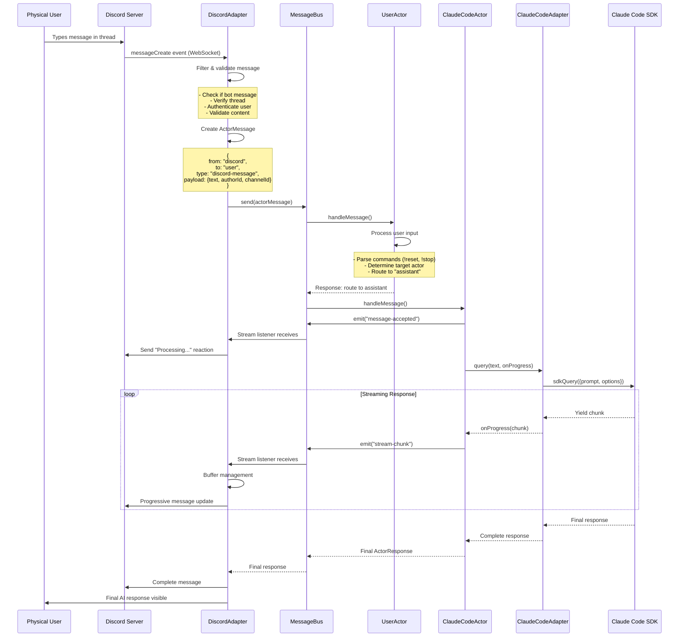
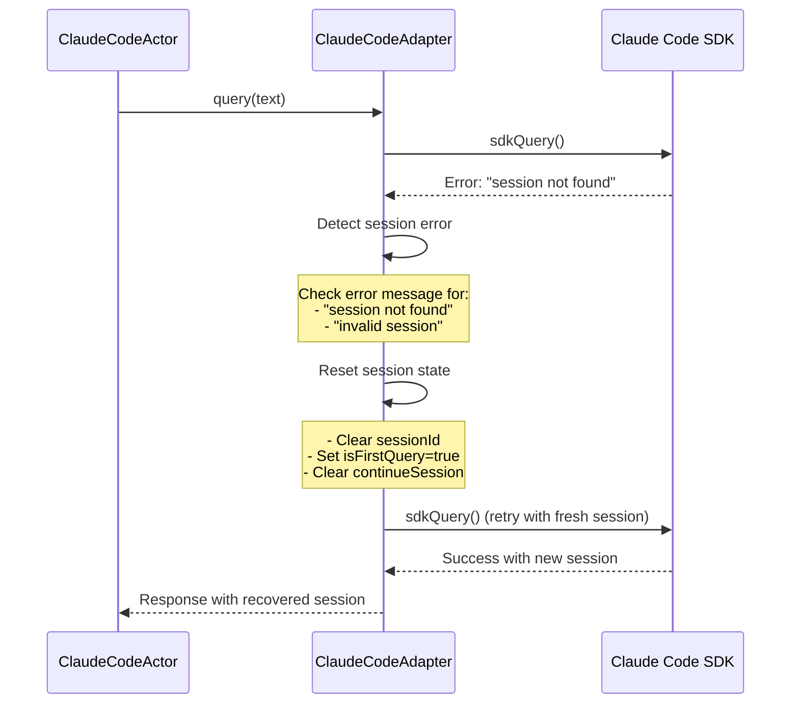

# メッセージフロー詳細解析

## 目次
- [フロー概要](#フロー概要)
- [詳細シーケンス図](#詳細シーケンス図)
- [各段階の処理内容](#各段階の処理内容)
- [ストリーミング応答フロー](#ストリーミング応答フロー)
- [エラー時のフロー](#エラー時のフロー)
- [デバッグとトラブルシュート](#デバッグとトラブルシュート)
- [パフォーマンス分析](#パフォーマンス分析)

## フロー概要

cc-discordにおけるメッセージフローは、**Discord → MessageBus → Actor群 → Claude Code SDK** という多層アーキテクチャを経由します。各段階で型変換、権限チェック、ルーティング判定が行われ、最終的にAI処理結果がストリーミング形式で逆方向に流れます。

### 高レベルフロー図

```
Physical User
     │ (Discord UI Input)
     ▼
┌─────────────────┐  WebSocket Event   ┌──────────────────┐
│  Discord Server │ ────────────────► │  DiscordAdapter  │
│   (External)    │                   │   (Entry Point)  │ 
└─────────────────┘                   └──────────────────┘
                                               │
                                               │ ActorMessage
                                               ▼
                                      ┌──────────────────┐
                                      │   MessageBus     │
                                      │ (Message Router) │
                                      └──────────────────┘
                                               │
                         ┌─────────────────────┼─────────────────────┐
                         │                     │                     │
                         ▼                     ▼                     ▼
                ┌─────────────────┐  ┌─────────────────┐  ┌─────────────────┐
                │   UserActor     │  │AutoResponder    │  │ ClaudeCodeActor │
                │ (Input Router)  │  │     Actor       │  │ (AI Processor)  │
                └─────────────────┘  └─────────────────┘  └─────────────────┘
                         │                     │                     │
                         │ (routes to)         │                     │
                         └─────────────────────┼─────────────────────┘
                                               │
                                               ▼
                                    ┌─────────────────────┐
                                    │ ClaudeCodeAdapter   │
                                    │  (API Wrapper)      │
                                    └─────────────────────┘
                                               │
                                               │ SDK Query
                                               ▼  
                                    ┌─────────────────────┐
                                    │ Claude Code SDK     │
                                    │   (AI Engine)       │
                                    └─────────────────────┘
```

## 詳細シーケンス図

### 完全なリクエスト・レスポンスフロー



## 各段階の処理内容

### 1. Discord WebSocket Event Reception

**ファイル**: `src/adapter/discord-adapter.ts:121`

```typescript
// WebSocket イベント登録
this.client.on("messageCreate", (message) => this.handleMessage(message));

// 受信処理
private async handleMessage(message: Message): Promise<void> {
  // フィルタリング段階
  if (message.author.bot) return;                    // Bot除外
  if (!this.currentThread || 
      message.channel.id !== this.currentThread.id) return;  // スレッド限定
  if (!this.isUserAllowed(message.author.id)) return;       // 認証チェック
  
  const content = message.content.trim();
  if (!content) return;                              // 空メッセージ除外
  
  // 監査ログ記録
  await this.auditLogger.logInfo("discord-adapter", "user_message", {
    userId: message.author.id,
    username: message.author.username,
    message: content.substring(0, 200)  // プライバシー考慮
  });
```

### 2. ActorMessage 変換

**型変換処理**:

```typescript
// Discord Message → ActorMessage 変換
const actorMessage: ActorMessage = {
  id: message.id,                    // Discord のメッセージID保持
  from: "discord",                   // 送信者はDiscordAdapter
  to: "user",                       // 宛先はUserActor
  type: "discord-message",          // メッセージタイプ
  payload: {
    text: content,                  // ユーザーが入力したテキスト
    authorId: message.author.id,    // Discord ユーザーID
    channelId: message.channel.id,  // Discord チャンネル/スレッドID
  },
  timestamp: new Date(),
};
```

### 3. MessageBus ルーティング

**ファイル**: `src/message-bus.ts:24-36`

```typescript
async send(message: ActorMessage): Promise<ActorResponse | null> {
  // 宛先Actor検索
  const targetActor = this.actors.get(message.to);  // "user" → UserActor
  
  if (!targetActor) {
    console.log(`[MessageBus] Actor not found: ${message.to}`);
    return null;
  }

  console.log(`[MessageBus] Sending message from ${message.from} to ${message.to}`);
  
  // Actor にメッセージ配送
  return await targetActor.handleMessage(message);
}
```

### 4. UserActor 処理とルーティング判定

**ファイル**: `src/actors/user-actor.ts:37-167`

```typescript
async handleMessage(message: ActorMessage): Promise<ActorResponse | null> {
  const content = message.payload as { text?: string };
  const text = content.text || "";

  // コマンド処理
  if (text.startsWith("!")) {
    const command = text.substring(1).split(" ")[0];
    return this.handleCommand(message, command);  // !reset, !stop 等
  }

  // ルーティング判定
  const targetActor = this.determineTargetActor(text);
  
  return this.createResponse(
    targetActor,                    // "assistant" がデフォルト
    "user-message",
    {
      text,
      originalFrom: message.from,   // "discord"
      originalMessageId: message.id,
      channelId: content.channelId
    },
    message.id
  );
}

private determineTargetActor(text: string): string {
  if (text.toLowerCase().includes("debug")) return "debug";
  if (text.toLowerCase().includes("task") || 
      text.toLowerCase().includes("todo")) return "auto-responder";
  return "assistant";  // Claude Code がデフォルト
}
```

### 5. ClaudeCodeActor AI処理開始

**ファイル**: `src/actors/claude-code-actor.ts:54-179`

```typescript
async handleMessage(message: ActorMessage): Promise<ActorResponse | null> {
  const content = message.payload as {
    text?: string;
    originalMessageId?: string;
    channelId?: string;
  };
  
  // 即座に処理受付を通知
  if (this.bus && channelId) {
    await this.bus.emit({
      from: this.name,
      to: "discord", 
      type: "message-accepted",
      payload: { originalMessageId, channelId, text: "[accepted]" }
    });
  }

  // ストリーミング対応クエリ実行
  const response = await this.adapter.query(text, async (chunk) => {
    // リアルタイムストリーミング配信
    await this.bus!.emit({
      from: this.name,
      to: "discord",
      type: "stream-chunk", 
      payload: { text: chunk.content, originalMessageId, channelId }
    });
  });
  
  return this.createResponse(/* 最終レスポンス */);
}
```

### 6. Claude Code SDK 呼び出し

**ファイル**: `src/adapter/claude-code-adapter.ts:117-121`

```typescript
const response = this.client.query({
  prompt: actualPrompt,
  options: {
    maxTurns: this.config.maxTurns,
    model: this.config.model,
    permissionMode: this.config.claudePermissionMode,
    continue: !this.isFirstQuery,
    resume: this.config.sessionId
  }
});

// ストリーミング処理
for await (const message of response) {
  if (onProgress) {
    await onProgress(message);  // ClaudeCodeActor のコールバック
  }
  
  // メッセージ種別毎の処理
  if (message.type === "assistant") {
    // AI応答テキスト
  } else if (message.type === "system" && message.subtype === "init") {
    // セッション開始
    this.currentSessionId = message.session_id;
  } else if (message.type === "user") {
    // ツール実行結果
  }
}
```

## ストリーミング応答フロー

### リアルタイム配信の仕組み

```
Claude Code SDK → ClaudeCodeAdapter → ClaudeCodeActor → MessageBus → DiscordAdapter → Discord UI
     (chunks)        (onProgress)       (emit)           (listeners)     (buffer)      (realtime)
```

### DiscordAdapter でのストリーミング受信

**ファイル**: `src/adapter/discord-adapter.ts:54-56`

```typescript
// MessageBus リスナー登録
this.busListener = (msg: ActorMessage) => this.handleStreamEvent(msg);
this.messageBus.addListener(this.busListener);

// ストリーミングイベント処理
private handleStreamEvent(message: ActorMessage): void {
  if (message.type === "stream-chunk") {
    const payload = message.payload as StreamChunkPayload;
    
    // バッファリング状態管理
    let state = this.streamStates.get(payload.originalMessageId);
    if (!state) {
      state = { buffer: "", mode: "append", channelId: payload.channelId };
      this.streamStates.set(payload.originalMessageId, state);
    }
    
    // テキスト追加
    state.buffer += payload.text;
    
    // レート制限対策: 1秒間隔で更新
    if (state.timer) clearTimeout(state.timer);
    state.timer = setTimeout(async () => {
      await this.sendToDiscord(state.buffer, payload.channelId);
    }, 1000);
  }
}
```

### バッファリング戦略

```typescript
private streamStates: Map<string, {
  buffer: string;           // 累積テキスト
  toolBuffer: string;       // ツール結果用バッファ  
  timer?: number;          // 更新タイマー
  thinkingMessage?: Message; // "考え中..." メッセージ
  mode: "edit" | "append";  // 更新モード
  channelId?: string;       // Discord チャンネルID
}> = new Map();
```

**Append Mode (デフォルト)**:
- 各更新で新しいDiscordメッセージを投稿
- レスポンスの段階的な進行が視覚的に分かりやすい
- 長い応答でも Discord の文字数制限に引っかからない

**Edit Mode**:
- 同じDiscordメッセージを編集し続ける  
- よりコンパクトな表示
- Discord API のレート制限に注意が必要

## エラー時のフロー

### セッション期限切れ自動復旧



### Actor レベルでの障害隔離

```typescript
// 各Actor での統一的エラーハンドリング
async handleMessage(message: ActorMessage): Promise<ActorResponse | null> {
  try {
    return await this.processMessage(message);
  } catch (error) {
    console.error(`[${this.name}] Error processing message:`, error);
    
    // エラーレスポンス生成（他のActorには影響しない）
    return this.createResponse(
      message.from,
      "error",
      { 
        error: error instanceof Error ? error.message : "Unknown error",
        originalMessageId: message.id
      },
      message.id
    );
  }
}
```

## デバッグとトラブルシュート

### ログレベルと出力場所

```typescript
// 各層でのログ出力
console.log(`[DiscordAdapter] Message received from ${message.author.username}`);
console.log(`[MessageBus] Sending message from ${message.from} to ${message.to}`);
console.log(`[UserActor] Processing user input: ${text}`);
console.log(`[ClaudeCodeActor] Processing message with Claude Code`);
console.log(`[ClaudeCodeAdapter] Session started: ${sessionId}`);
```

### 問題診断のチェックポイント

#### 1. Discord 接続問題
```bash
# 権限チェック
[DiscordAdapter] Discord ready: BotName#1234
[DiscordAdapter] Thread created: Claude Session - 2024/08/27

# 権限エラーの場合
Error: Missing permissions for CREATE_PUBLIC_THREADS
```

#### 2. メッセージルーティング問題  
```bash
# 正常ケース
[MessageBus] Sending message from discord to user
[MessageBus] Sending message from user to assistant

# Actor未登録の場合
[MessageBus] Actor not found: assistant
```

#### 3. Claude Code 接続問題
```bash
# 認証エラー
Claude Code preflight check failed: Authentication required

# セッション問題  
[ClaudeCodeAdapter] Session not found error detected. Resetting and retrying...
[ClaudeCodeAdapter] Session started: abc-123-def
```

### 診断用ツール

**claude-diagnose.ts**:
```bash
# 診断スクリプト実行
deno task claude:diagnose

# チェック項目:
# - Claude Code CLI の認証状態
# - 権限設定の確認  
# - ネットワーク接続
# - セッション状態
```

## パフォーマンス分析

### レスポンス時間の測定ポイント

```typescript
// 各段階での処理時間測定
const startTime = Date.now();

// Discord → MessageBus
const routingTime = Date.now();
console.log(`Routing time: ${routingTime - startTime}ms`);

// MessageBus → Claude Code
const processingStart = Date.now();
const response = await this.adapter.query(text);
const processingTime = Date.now() - processingStart;
console.log(`AI processing time: ${processingTime}ms`);

// ストリーミング配信時間
const streamingStart = Date.now();
// ... streaming logic ...
const streamingTime = Date.now() - streamingStart; 
console.log(`Streaming delivery time: ${streamingTime}ms`);
```

### ボトルネック特定

**典型的な処理時間**:
- Discord WebSocket → DiscordAdapter: **< 10ms** 
- DiscordAdapter → MessageBus → UserActor: **< 5ms**
- UserActor → ClaudeCodeActor: **< 5ms**
- Claude Code SDK 呼び出し: **2-10 seconds** (AI処理時間)
- ストリーミング配信: **50-200ms per chunk**

**最適化ポイント**:
- Claude Code処理: モデル・maxTurns設定で調整
- ストリーミング: バッファサイズ・更新間隔の調整
- Discord API: レート制限を考慮したバッファリング

このメッセージフロー解析により、cc-discordの動作を詳細に理解し、問題発生時の迅速な診断が可能になります。

---

最終更新: 2024年8月